# Lab1Web

Dasar - dasar tag HTML (Praktikum 1)

## Membuat Repository

1. login github buat repository baru dengan judul **Lab1web**

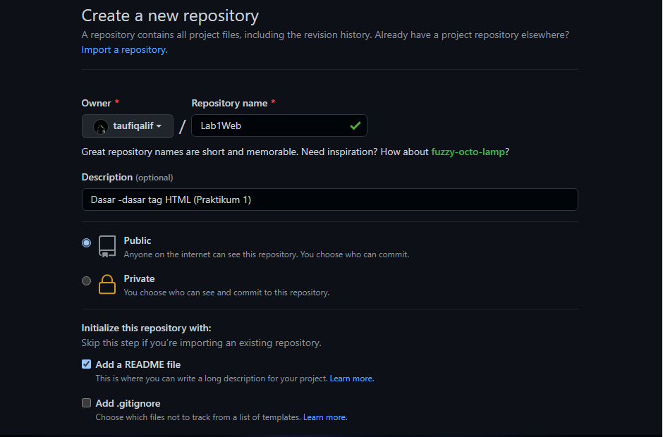

2. clone URL github Lab1web

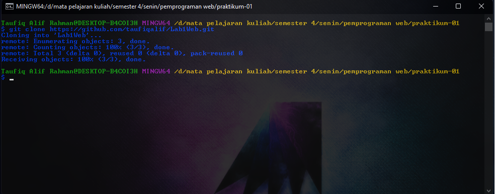

setelah di clone maka akan ada folder dan file README

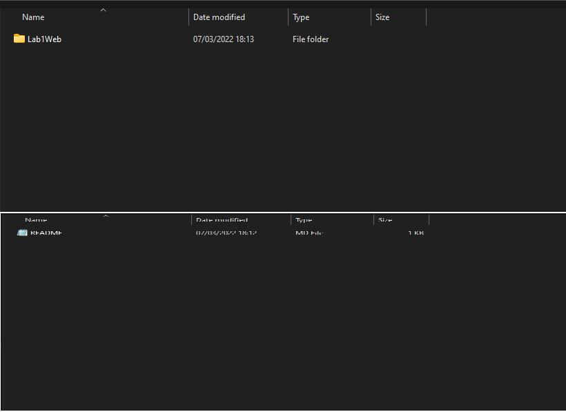

## Membuat halaman web dasar 

1. buka text editor (saya disinih menggunakan VS Code sebagai editor)
2. kemudian kelik **file** pilih **open folder**, buka folde yang tadi di clone (**Lab1Web**)

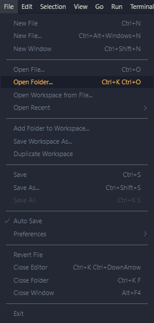

3. maka akan tampil sebagai berikut

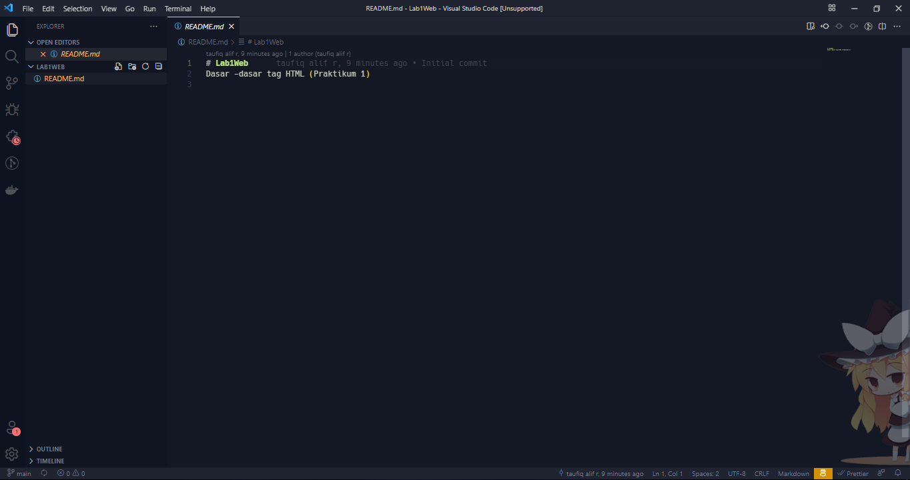

4. buat file baru dengan nama `lab1_tag_dasar.html`

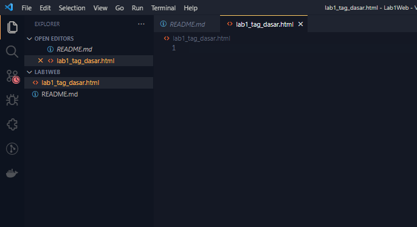

5. buatlah struktur HTML 

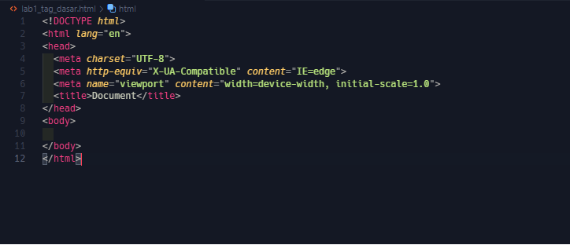

dokumen masih kosong 

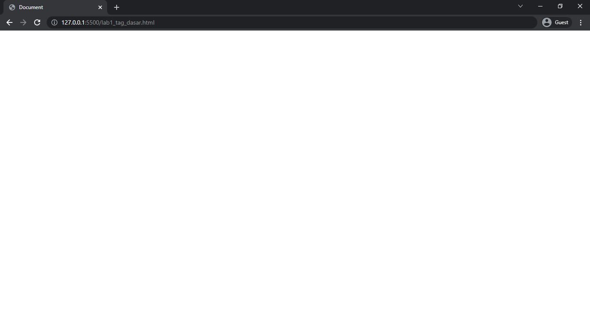

6. rubah title menjadi `Tag HTML dasar`

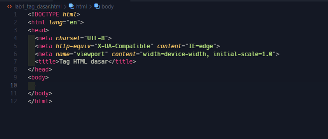

7. membuat 2 paragraf menggunakan tag `

`

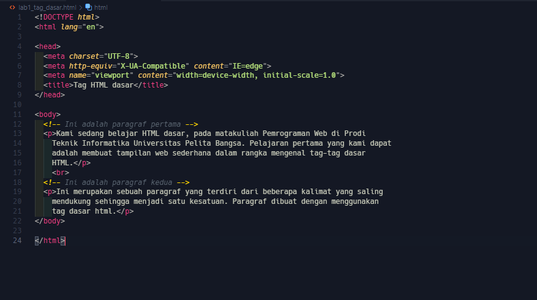

maka akan tampil sebagai berikut

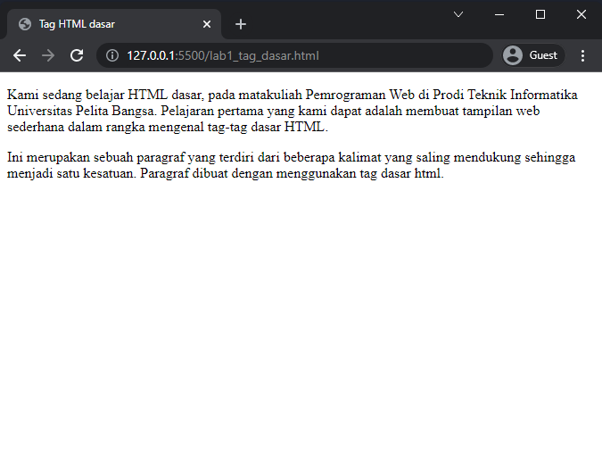

8. kemudian mengatur atribut paragraf dengan menggunkan `atribut align`

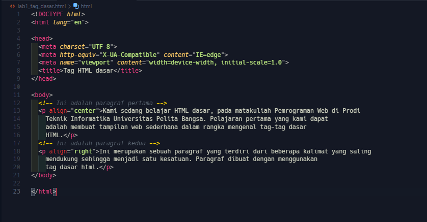
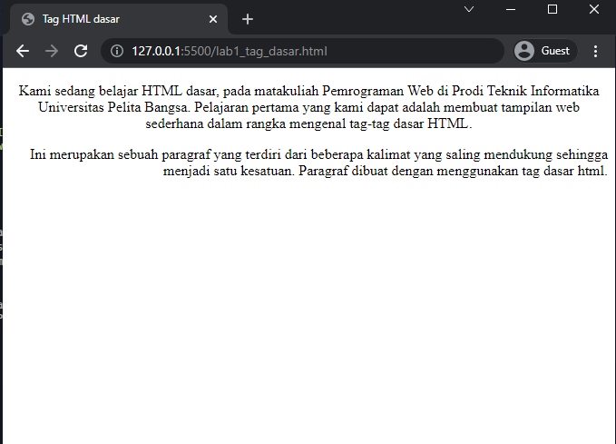

    atribut align="right" -> mengatur paragraf di posisi kana
    atribut align="center" -> mengatur paragraf di posisi tengah
    atribut align="left" -> mengatur paragraf di posisi kiri

9. membuat judul halaman menggunakan tag `h1 dan h2`

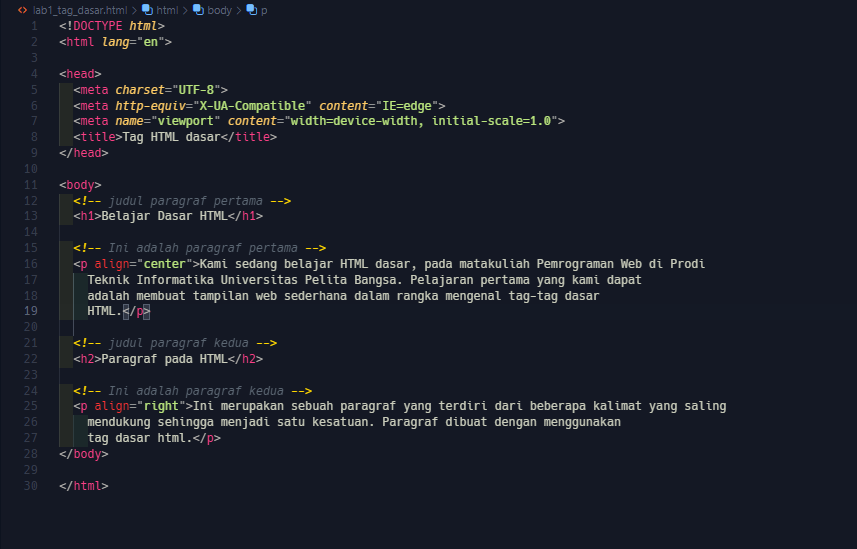
maka akan tampil sebagaiberikut...
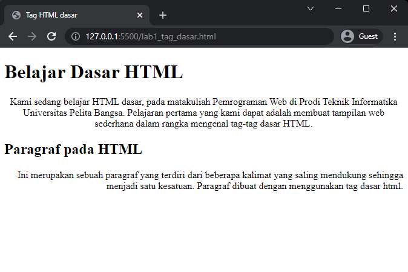

### Tag Heading
    Heading merupakan sebuah judul yang biasanya digunakan pada sebuah halaman artikel pada web.
    Atau terkadang dibeberapa bagian dari halaman web.
    Judul atau heading pada dokumen HTML dapat dibuat dengan menggunakan tag <h1> sampai <h6>.
    Tag <h1> merupakan judul pada lever pertama, kemudian level berikutnya atau sub judul pada tag
    <h2> dan seterusnya sampai tag <h6>.

    <h1>Heading 1</h1>
    <h2>Heading 2</h2>
    <h3>Heading 3</h3>
    <h4>Heading 4</h4>
    <h5>Heading 5</h5>
    <h6>Heading 6</h6>

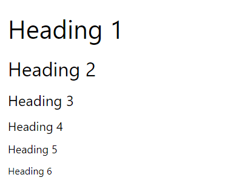

10. 
