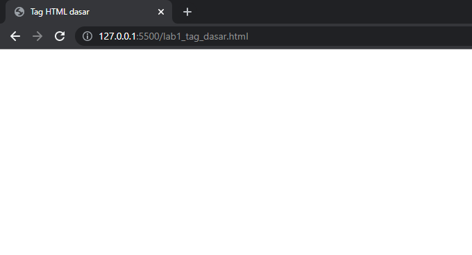

# Lab1Web

Dasar - dasar tag HTML (Praktikum 1)

## Membuat Repository

1. login github buat repository baru dengan judul **Lab1web**

2. clone URL github Lab1web

setelah di clone maka akan ada folder dan file README

## Membuat halaman web dasar 

1. buka text editor (saya disinih menggunakan VS Code sebagai editor)
2. kemudian kelik **file** pilih **open folder**, buka folde yang tadi di clone (**Lab1Web**)

3. maka akan tampil sebagai berikut

4. buat file baru dengan nama `lab1_tag_dasar.html`

5. buatlah struktur HTML 

dokumen masih kosong 

6. rubah title menjadi `Tag HTML dasar`

7. membuat 2 paragraf menggunakan tag `

`

maka akan tampil sebagai berikut

8. kemudian mengatur atribut paragraf dengan menggunkan `atribut align`

    atribut align="right" -> mengatur paragraf di posisi kana
    atribut align="center" -> mengatur paragraf di posisi kana
    atribut align="left" -> mengatur paragraf di posisi kana